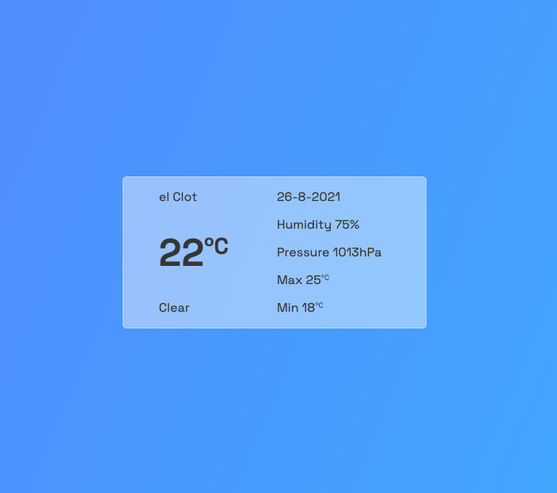

# LOCAL WEATHER

## Descripción

Una App que muestra el clima local usando una API para las condiciones climáticas y la geolocalización del usuario .

Habilitando los permisos de localización, esta App te indicará: localización, temperatura (en grados centígrados, estado general, fecha, porcentaje de humedad, presión atmosférica y temperaturas mínimas y máximas del día.)

El fondo de la web está animado con un gradiente de colores.

## Screenshots

## Sobre el código

Estoy trabajando en la mejora de esta app y en la refactorización del código.

## Links

- [Code](https://github1s.com/albavidalm/Local-weather/ "Code")

- [Live](https://albavidalm.github.io/Local-weather/ "Live View")

## Commands

Puedes descargarte el código, instalarlo y arrancarlo en tu terminal.

## Built With

- JavaScript
- DOM avanzado
- HTML
- CSS

## Autora

**Alba Vidal**

- [Profile](https://github.com/albavidalm "Alba Vidal")
- [Email](mailto:albavidalm@gmail.com?subject=Hi "Hi!")
- [Linkedin](https://www.linkedin.com/in/albavidalm/ "Let's work together!")

## 🖤 Support

Compartir es vivir, contributiones y sugerencias son siempre bienvenidas.
